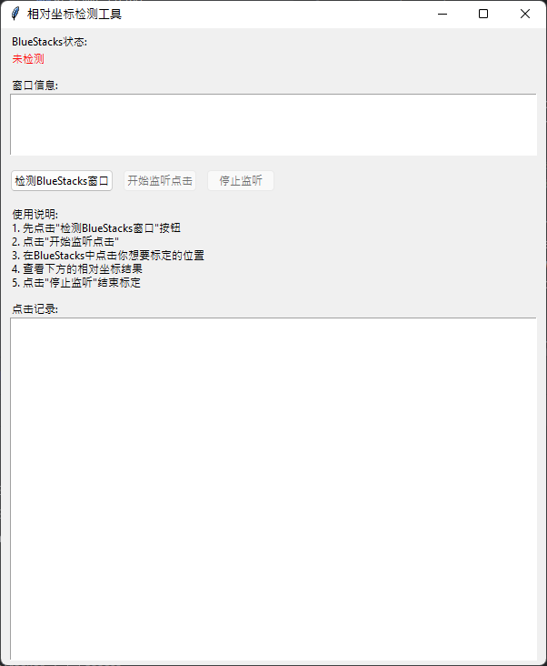
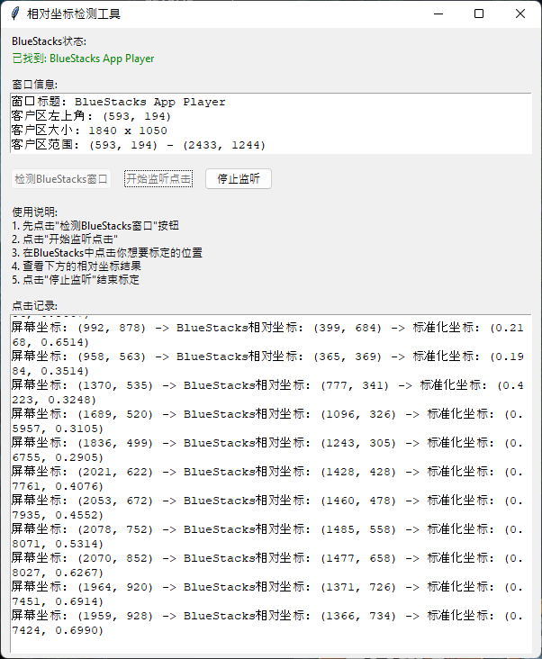

# ClickTracker

<p align="center">
  🌐 <strong>Language</strong> | 🇯🇵 <a href="./README.md"><strong>日本語</strong></a> | 🇺🇸 <a href="./README_en.md"><strong>English</strong></a> | 🇨🇳 <a href="./README_ch.md"><strong>中文</strong></a>
</p>

Windowsアプリケーション用の相対座標取得ツール

## 概要

ClickTrackerは、任意のWindowsアプリケーションウィンドウ内でのマウスクリック位置を検出し、そのウィンドウ内での相対座標および標準化座標を取得するためのPythonツールです。デフォルトでは「BlueStacks」を対象としていますが、すべてのWindowsアプリケーションで使用できます。

## 主な機能

- **ウィンドウ自動検出**: 指定したキーワードを含む任意のWindowsアプリケーションウィンドウを自動検出
- **リアルタイム座標取得**: マウスクリック時にリアルタイムで以下の座標を取得
  - 画面座標（スクリーン座標）
  - ウィンドウ内での相対座標
  - 標準化された座標（0-1の範囲）
- **GUIインターフェース**: 直感的で使いやすいGUI
- **プログラム用API**: スクリプトから直接呼び出し可能なシンプルなAPI
- **高DPI対応**: 高解像度ディスプレイに対応

## 必要なライブラリ

```
pyautogui
pywin32
pynput
tkinter (Pythonに標準搭載)
```

## インストール

```bash
pip install pyautogui pywin32 pynput
```

## 使用方法

### GUI使用

<p align="center">
  
  
</p>

```bash
python main.py
```

1. 「検出BlueStacksウィンドウ」ボタンをクリックして対象ウィンドウを検出
2. 「開始監聴点撃」ボタンをクリックして監視を開始
3. 対象ウィンドウ内で任意の位置をクリック
4. 相対座標と標準化座標が表示される
5. 「停止監聴」ボタンで監視を終了

### プログラムでの使用

```python
from main import SimpleClickDetector

# 検出器を初期化（デフォルトは"BlueStacks"、任意のキーワードに変更可能）
detector = SimpleClickDetector("対象アプリ名")

# 画面座標を相対座標に変換
relative_pos, info = detector.screen_to_relative(100, 200)
if relative_pos:
    print(f"相対座標: {relative_pos}")

# 相対座標を画面座標に変換
screen_pos, info = detector.relative_to_screen(50, 75)
if screen_pos:
    print(f"画面座標: {screen_pos}")
```

## 取得できる座標情報

- **画面座標**: ディスプレイ全体での絶対座標
- **相対座標**: ウィンドウのクライアント領域内での座標（左上が(0,0)）
- **標準化座標**: ウィンドウサイズに対する比率座標（0.0-1.0の範囲）

## 対応環境

- Windows 10/11
- Python 3.6以上
- すべてのWindowsアプリケーション

## 注意事項

このプログラムはすべてのWindowsウィンドウで相対座標と標準座標を取得することができます。