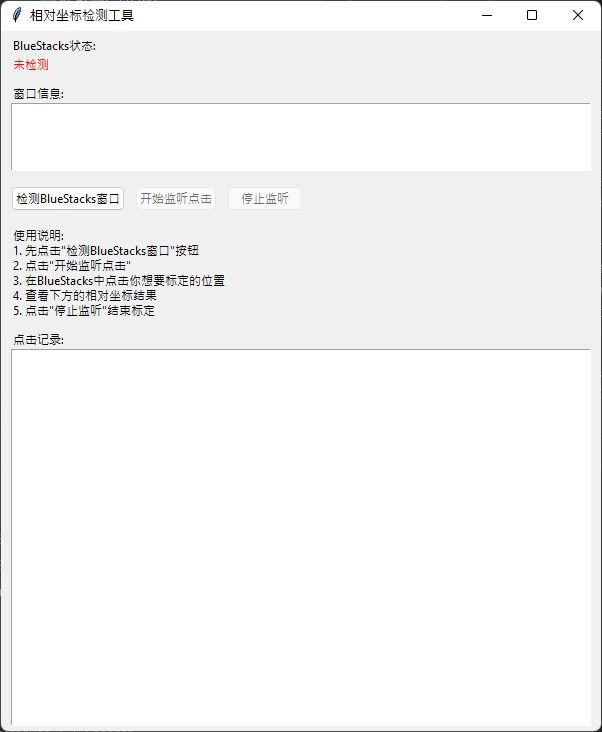
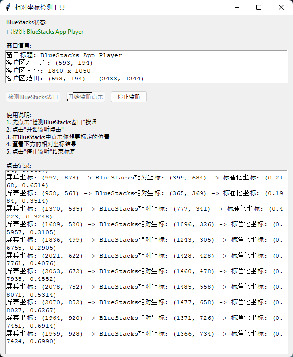

# ClickTracker

Windows应用程序相对坐标获取工具

## 项目概述

ClickTracker是一个Python工具，用于检测在任意Windows应用程序窗口内的鼠标点击位置，并获取该窗口内的相对坐标和标准化坐标。虽然默认针对"BlueStacks"，但可以用于所有Windows应用程序。

写这个工具的目的是：用来找Bluestacks上COC的按钮区域的，因为Bluestacks上面的COC长宽比是固定的，所以只要知道标准坐标，就可以在任意缩放的界面都可以精准找到按钮所在区域。

## 主要功能

- **自动窗口检测**：自动检测包含指定关键词的任意Windows应用程序窗口
- **实时坐标获取**：鼠标点击时实时获取以下坐标：
  - 屏幕坐标（绝对坐标）
  - 窗口内相对坐标
  - 标准化坐标（0-1范围）
- **图形用户界面**：直观易用的GUI界面
- **程序API**：可直接从脚本调用的简单API
- **高DPI支持**：支持高分辨率显示器

## 依赖库

```
pyautogui
pywin32
pynput
tkinter（Python标准库）
```

## 安装

```bash
pip install pyautogui pywin32 pynput
```

## 使用方法

### GUI使用

<p align="center">
  
  
</p>

```bash
python main.py
```

1. 点击"检测BlueStacks窗口"按钮检测目标窗口
2. 点击"开始监听点击"按钮开始监控
3. 在目标窗口内点击任意位置
4. 查看显示的相对坐标和标准化坐标
5. 点击"停止监听"按钮结束监控

### 编程使用

```python
from main import SimpleClickDetector

# 初始化检测器（默认为"BlueStacks"，可更改为任意关键词）
detector = SimpleClickDetector("目标应用名")

# 将屏幕坐标转换为相对坐标
relative_pos, info = detector.screen_to_relative(100, 200)
if relative_pos:
    print(f"相对坐标: {relative_pos}")

# 将相对坐标转换为屏幕坐标
screen_pos, info = detector.relative_to_screen(50, 75)
if screen_pos:
    print(f"屏幕坐标: {screen_pos}")
```

## 坐标信息类型

- **屏幕坐标**：整个显示器的绝对坐标
- **相对坐标**：窗口客户区内的坐标（左上角为(0,0)）
- **标准化坐标**：相对于窗口大小的比例坐标（0.0-1.0范围）

## 系统要求

- Windows 10/11
- Python 3.6+
- 支持所有Windows应用程序

## 特别说明

此程序可以用于所有Windows窗口来获得相对坐标和标准坐标。

如果未来想要抓其他窗口的坐标，只要把代码里面的Bluestacks变成其他的软件就行了，代码几乎通用。

其实我现在就可以改动一下，把Bluestacks变成一个变量，甚至可以在GUI上面填这个变量，就是填入对应关键词，但是我太懒了，不干了。